# Prediction of Citation Counts in arXiv Papers
This project contains an exposition of arXiv condensed matter physics papers from 1992 - 2020. The dataset is obtained by scraping the [arXiv.org](https://arxiv.org) web page, and the citation counts for the papers were obtained in June, 2021 from the [ADS](https://ui.adsabs.harvard.edu) web page. 

The main objective of this project is to predict the citation counts of arXiv papers within a certain time frame. The predictive modeling can be cast as either a regression or classification problem; we have implemented both scenarios.

## Data Exploration

The figures below show the exploratory data analysis to understand the trends of arXiv condensed matter physics papers, and some of the factors that influence citation count. 

## 1. Distribution of Citation Count

 - The citation distribution (citation counts vs. the number of papers) in the log-log plot follows a power law relationship as established by R. Yan et al. in Proceeding of CIKM, CIKM '11, 2011.
 
 - The plot shows that a huge number of research papers attract only a few citations, and a few research papers accumulate a large number of citations.
 
 - The most recent papers attract few citations than those published 10-13 years ago.

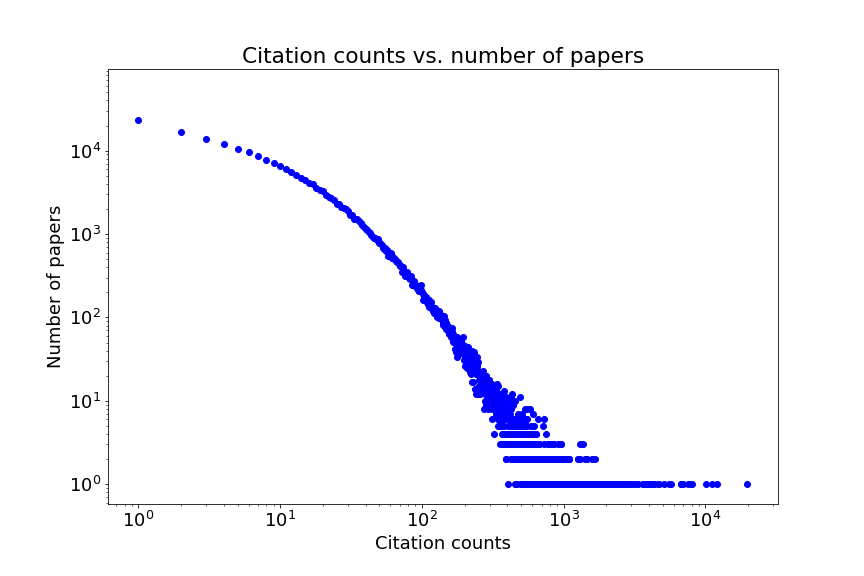
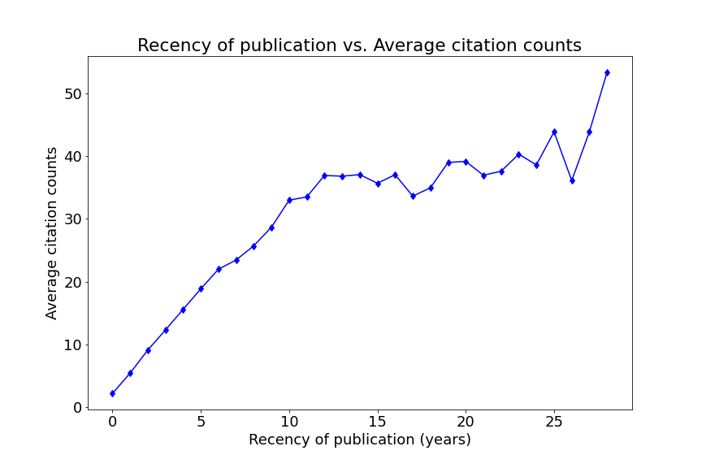

## 2. Top arXiv Papers with the most Citations

- The top two arXiv papers with the most citations are [cond-mat/0410550](https://arxiv.org/abs/cond-mat/0410550) and [arXiv:0709.1163](https://arxiv.org/abs/0709.1163).

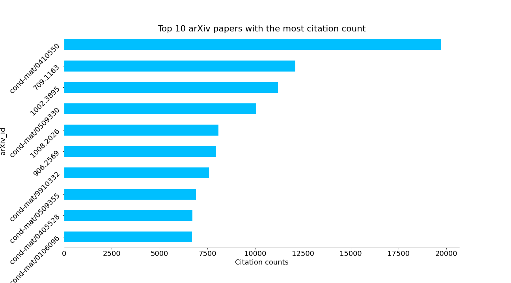

## 3. Most Common Words Used in Abstracts

- Condensed matter physicists are mostly interested in models, states, and quantum phases of systems.

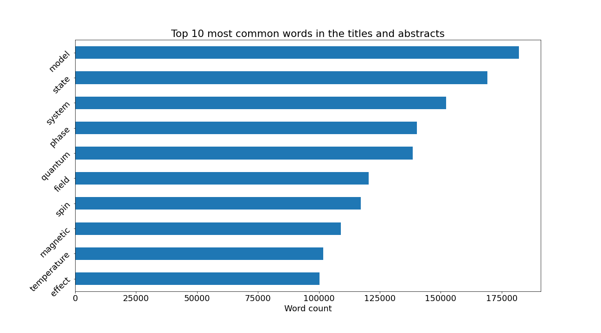

## 4. Trends of Posted Papers per Year

- The number of papers posted per year has an upward trend between 1992-2019, but declined in 2020 due to the global pandemic.

- The average number of authors per paper has an upward trend (i.e., more collaborative works).

- The median length of abstract seems to be increasing by year.

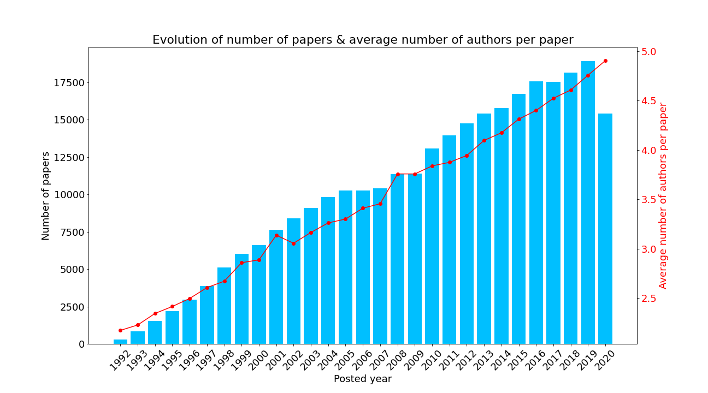
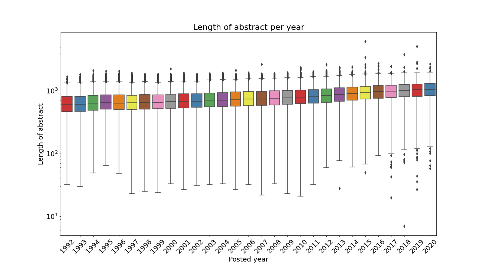
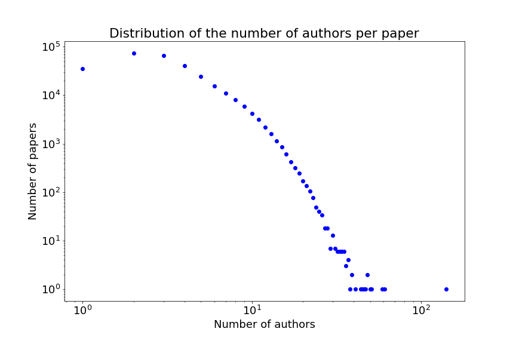

## 5. Trends of Posted Papers per Month

- Most arXiv condensed matter physics papers are posted in the months of March, July, and October.

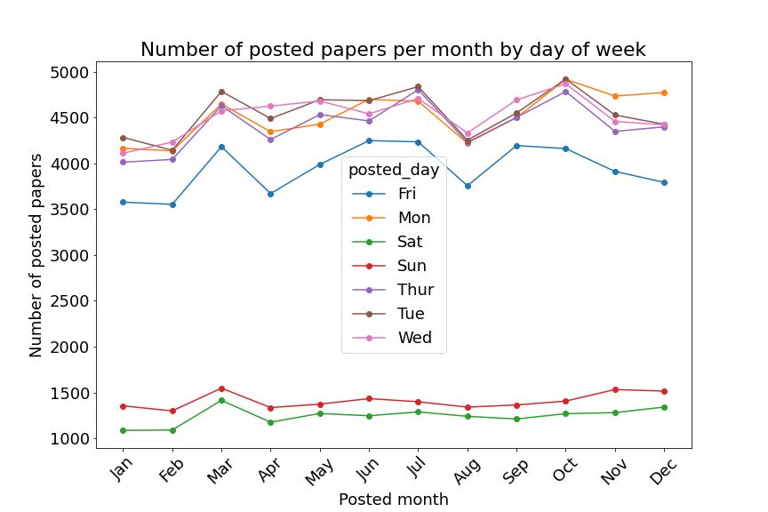

## 6. Trends of Posted Papers per Week Day

- Most arXiv condensed matter physics papers are posted on Tuesdays and the least number of papers are posted on weekends.

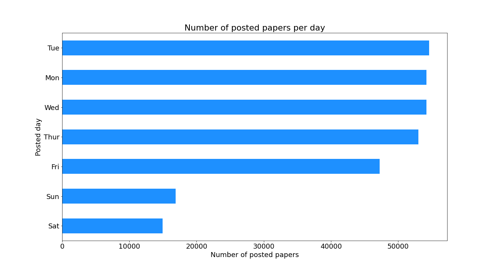

## 7. arXiv Papers with Most Authors and Longest Abstract

- The arXiv paper with the largest number of authors is [arXiv:1412.0138](https://arxiv.org/abs/1412.0138).

- The arXiv paper with longest abstract is [arXiv:1512.08505](https://arxiv.org/abs/1512.08505).

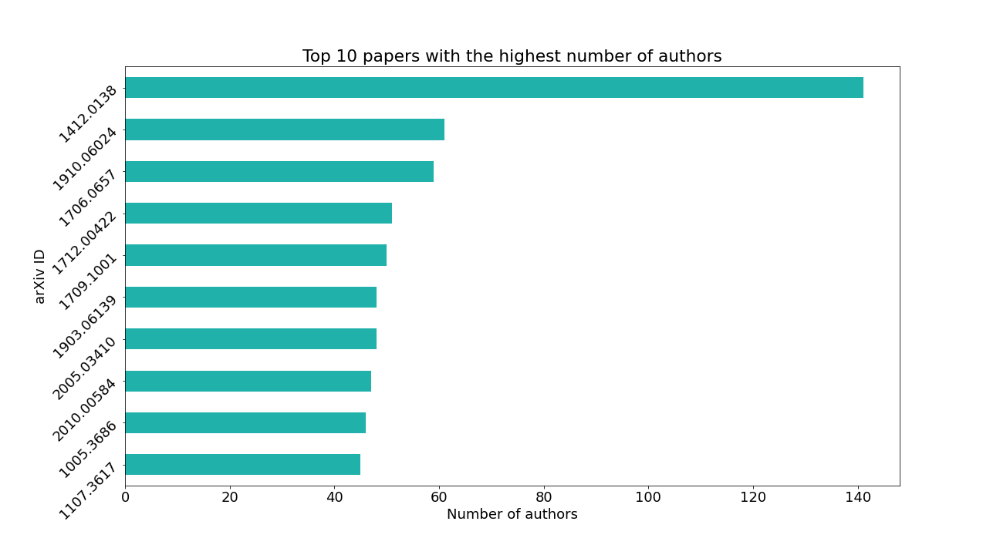
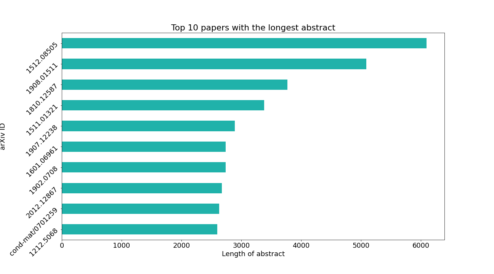